# Desarrollo

## Versión 1.0

### Análisis en 2D

En base a caracteres morfológicos discretos o el análisis univariado de variables escalares, una nueva especie de murciélago del género Molossus -definida genéticamente - no podía ser operativamente diferenciada de otros 3 molóssidos que cohabitan en la región central. A partir de este planteo, en base a criterios de factibilidad, se lograron identificar, seleccionar críticamente, implementar y testear comparativamente una batería de métodos de adquisición y análisis de datos multidimensionales de morfometría craneal basados en medidas lineales (Fig1) y landmarks en imágenes 2D (Fig2).


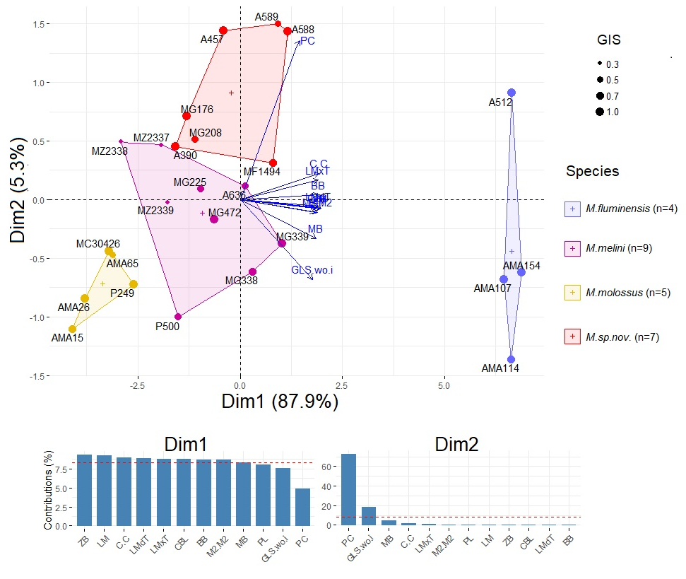{ .image50percent }


{ .image50percent }

### Análisis en 3D

Para llevar a cabo el análisis morfométrico en 3D, se emplearon técnicas de fotogrametría digital con el fin de obtener un modelo tridimensional del cráneo. 

La fotogrametría digital consiste en capturar imágenes del objeto desde múltiples ángulos y utilizar software especializado para combinar estas imágenes y reconstruir una representación tridimensional precisa del objeto en cuestión. Este enfoque permite capturar no solo las dimensiones lineales del objeto, sino también su forma y estructura en tres dimensiones, lo que proporciona una visión más completa de la morfología craneal. 

El modelo tridimensional obtenido se utilizará posteriormente para realizar análisis morfométricos detallados, permitiendo comparaciones precisas entre la nueva especie de murciélago y otras especies del género Molossus presentes en la región central.


#### Fotometría digital

Para ajustar el procedimiento, se utilizó inicialmente un modelo de cráneo de murciélago pálido (Antrozous pallidus) disponible gratuitamente en [thingiverse.com](https://www.thingiverse.com/thing:5380972). El modelo fue escalado para ajustarse al tamaño del cráneo de Molossus. 


Se estableció un setup experimental para capturar fotografías de manera automatizada. En primer lugar, se llevaron a cabo pruebas conceptuales utilizando motores paso a paso y una placa de desarrollo Arduino UNO:


Posteriormente, se exploró la viabilidad de emplear una cámara web USB para el proceso:


Se realizaron pruebas adicionales con una caja de iluminación para mejorar las condiciones de captura:


Con estas pruebas se obtuvieron imágenes de poca calidad que no capturaban todas las características del objeto de prueba.

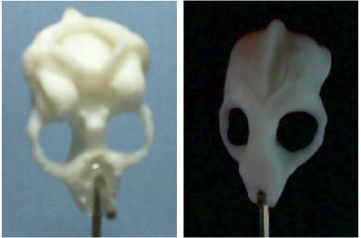

#### Escaner 3D

Para aumentar la repetibilidad en el escaneo de los cráneos, se decidió adaptar un modelo de escáner 3D utilizando la técnica de fotogrametría de OpenScan en su versión clásica. Este escáner puede ser producido mediante una impresora 3D con tecnología FDM, y los archivos necesarios están disponibles en [thingiverse.com](https://www.thingiverse.com/thing:2755968).

Para el diseño de las piezas personalizadas se utilizó el software de código abierto FreeCAD.

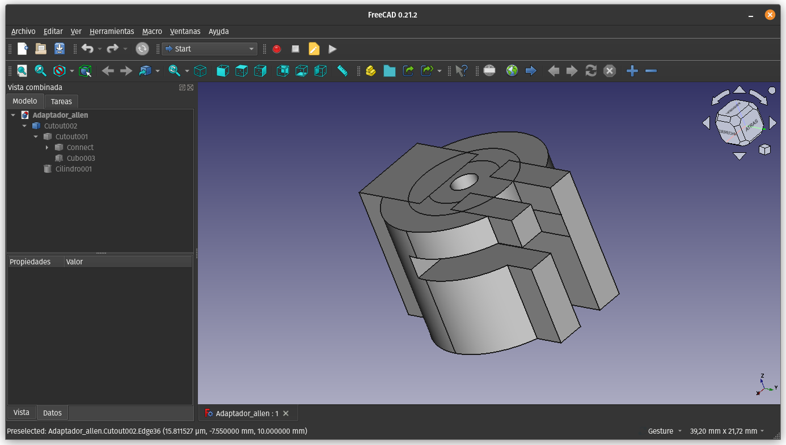


Las piezas fueron impresas en una impresora 3D Hellbot Magna 1v2 usando filamento PLA.

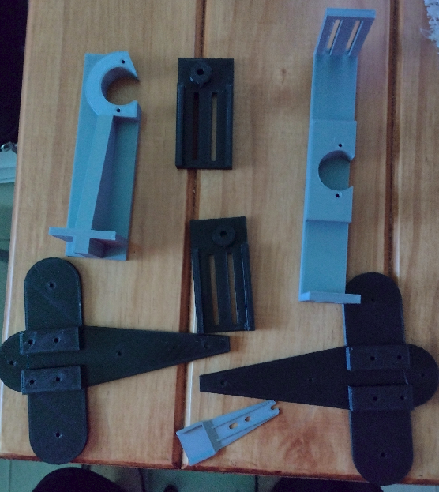


Finalmente, se llevó a cabo el ensamblaje de todas las partes para completar el escáner modificado.

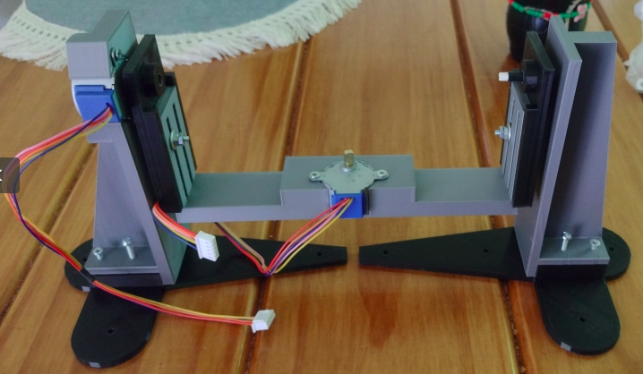

##### Rutina de Escaneo
Durante la prueba del escáner, se ejecuta una rutina de escaneo diseñada para capturar imágenes tridimensionales con precisión. Esta rutina comienza con un giro completo de 360° de la pieza en intervalos de 15°, deteniéndose en cada paso para la toma de las fotografías correspondientes. Posteriormente, el brazo lateral del escáner se inclina en un ángulo de 60° en ambas direcciones, con incrementos de 20° en cada movimiento. Cada vez que el brazo lateral se inclina, se realiza un giro completo de la pieza en escaneo, asegurando una cobertura exhaustiva del objeto en estudio.

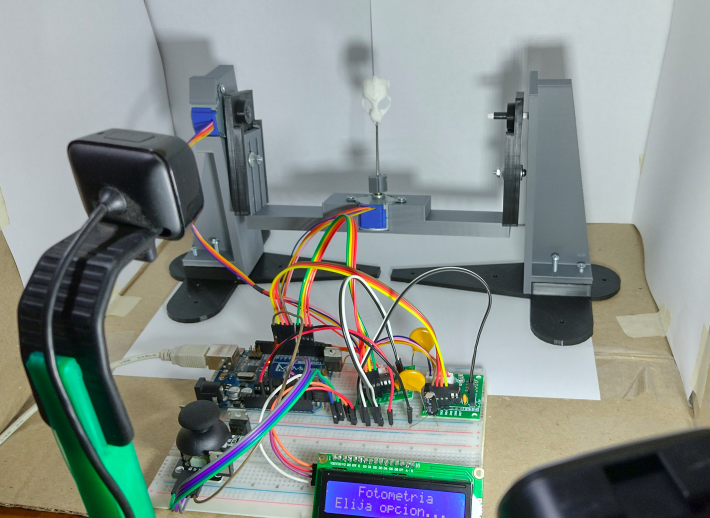


La rutina se puede apreciar en el siguiente gif:


### Procesado de Imágenes

#### Acondicionamiento

Para optimizar y preparar las imágenes capturadas por el escáner 3D, se utilizó el software de manipulación de imágenes GNU Image Manipulation Program (GIMP). Se empleó la extensión Batch Image Manipulation para aplicar procesamiento a múltiples imágenes de manera eficiente.

El proceso de acondicionamiento consta de las siguientes etapas:

- Recorte:

    - Se ajusta el recorte para alcanzar una relación de aspecto estándar de 1:1.

- Corrección de color:

    - Las imágenes son convertidas a escala de grises.
    - Se aplica una corrección automática de los niveles de color para mejorar la calidad visual.

- Renombrado:

    - Se realiza un renombrado de las imágenes siguiendo un patrón establecido para una mejor organización y referencia.

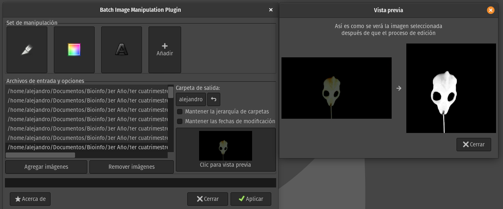

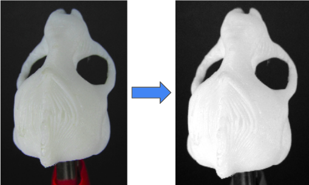


#### Reconstrucción 3D

La reconstrucción del modelo 3D se llevó a cabo utilizando el software de código abierto Meshroom. Este programa utiliza una técnica conocida como fotogrametría para reconstruir modelos tridimensionales a partir de imágenes 2D.

El proceso comienza cargando las imágenes obtenidas de cada escaneo en el programa Meshroom. A continuación, se ajustan los parámetros del flujo de trabajo, que incluyen configuraciones relacionadas con la detección de características, la correspondencia de puntos entre imágenes y la reconstrucción de la geometría del objeto escaneado.

Meshroom funciona utilizando un enfoque basado en la estructura de grafos para organizar y ejecutar las distintas etapas del proceso de reconstrucción. Cada imagen aporta información sobre la apariencia y la posición relativa del objeto desde diferentes ángulos, lo que permite al programa calcular la estructura tridimensional con precisión.

Es importante destacar que Meshroom es un proyecto de código abierto desarrollado por [AliceVision](https://alicevision.org), una comunidad de desarrollo de software que se enfoca en soluciones de visión por computadora y fotogrametría.

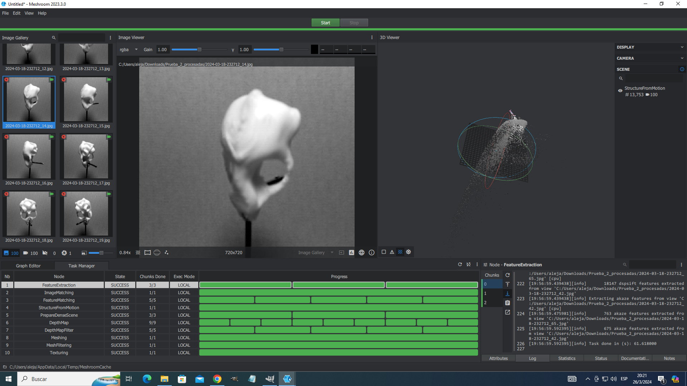

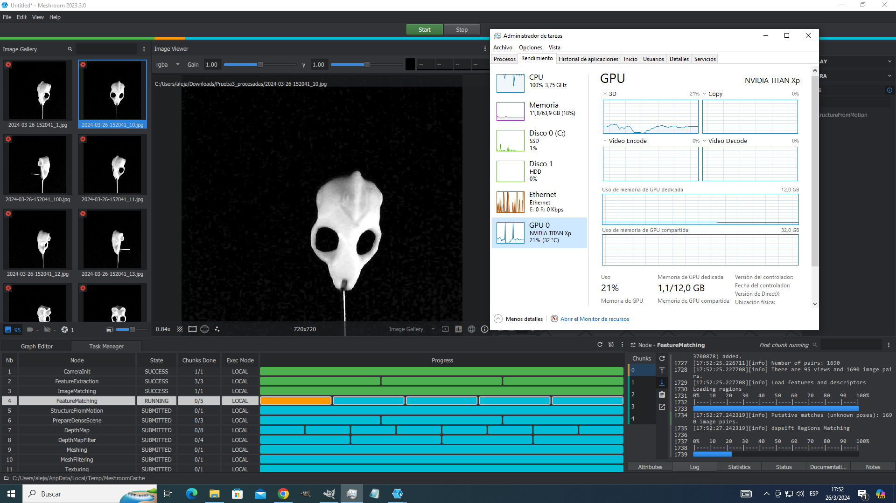

El análisis de las características de meshroom se puede observar aquí:

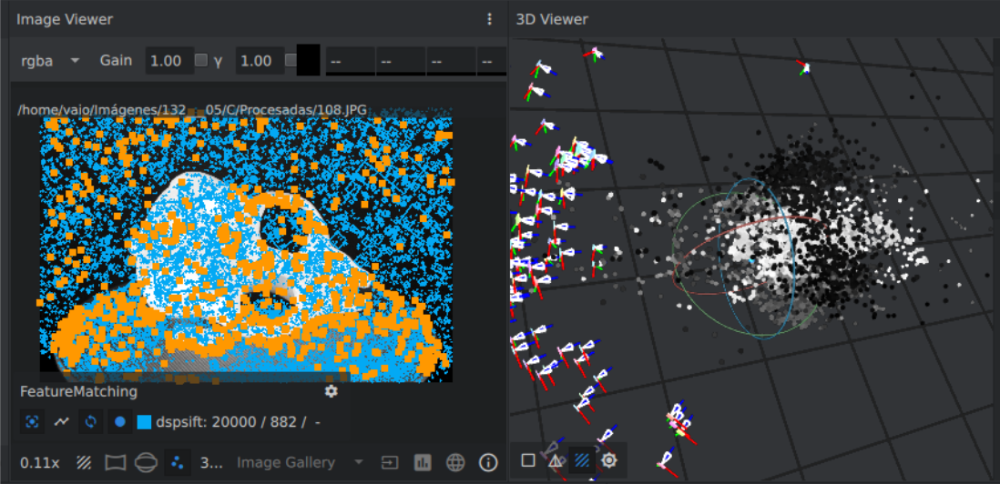

- En Azul --> Feature Extraction
- En Naranja --> Feature Matching
- En Rojo --> Used in Reconstruction
  

### Mejora Condiciones

#### Fotografías

Se adquirió una cámara fotográfica compacta para mejorar la calidad de las imágenes obtenidas. Se usó una cámara Canon PowerShoot sx510 hs.

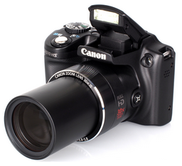

Se puede notar la considera mejora de la resolución:


Se agradece a la licenciada Fabiana Meza por el préstamo del equipo fotográfico.

#### Iluminación

Se mejoraron las condiciones de iluminación con luces LED flexibles que permitieran una iluminación uniforme sobre las muestras, para evitar sombras duras.

También se fabricó una caja de luz para lograr una iluminación controlada.

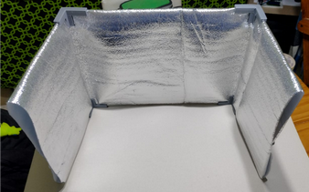

Se pueden observa las pruebas de iluminación a continuación:

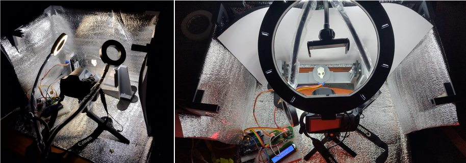


## Versión 2.0

Se mejoró el primer diseño, eliminando uno de los brazos del soporte, y se incorporó un nuevo motor NEMA 17 para mejorar los ángulos de movimiento del brazo.


### Flujo de Trabajo

#### Condiciones de Captura

Para tomar las fotografías de las muestras se emplearon los siguientes parámetros de la cámara:
 - Cantidad de fotos: ≈ 140-150 por muestra
 - Velocidad Obturador: 1/80 seg
 - Apertura Focal: F 5.0
 - Sensibilidad Sensor: ISO 100

Con el siguiente setup de trabajo:

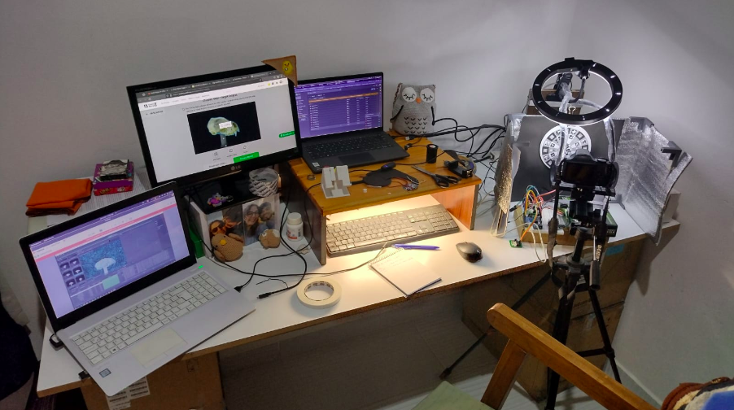

#### Procesado de Fotos

Primero se proceso el modelo 3D en Meshroom:


Luego las mallas 3D fueron corregidas en Blender para eliminar el fondo y reparar malformaciones y huecos en las mismas:

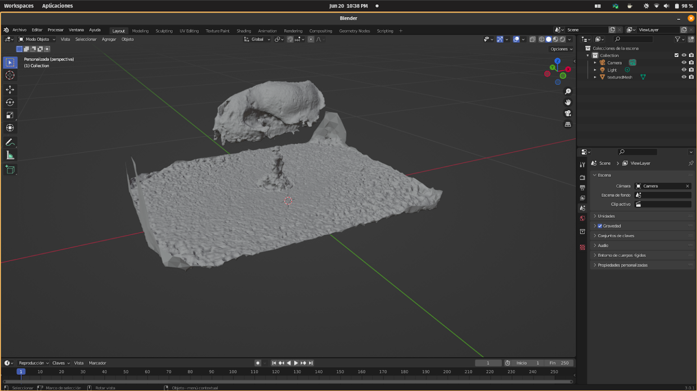

Se muestran las operaciones de limpieza realizadas para obtener el modelo final del cráneo:

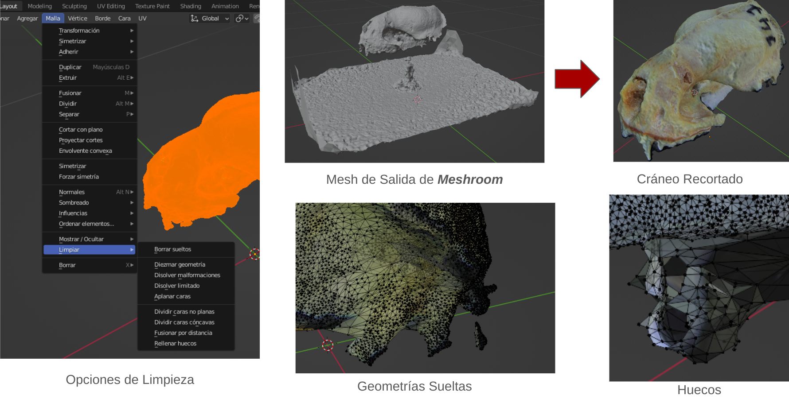

Luego estos pasos fueron replicados para cada muestra.

## Código arduino

El siguiente código controla todo el setup de escaneo. Se utilizaron motores paso a paso 28byj-48 con el controlador ULN2003, configurados en Modo de Medio Paso para garantizar un movimiento suave. La información sobre el proceso de escaneo se visualiza en una pantalla LCD 16x2 con controlador I2C, mientras que las opciones del escaneo son ingresadas por el usuario a través de un joystick.

``` c++ title="Escaner-fotometría.ino" linenums="1" 
#include <AccelStepper.h>
#include <Wire.h> 
#include <LiquidCrystal_I2C.h>

// stepper motor 28byj-48 
const int STEPS_PER_REVOLUTION = 2038;  // change this to fit the number of steps per revolution

// Base Giratoria
const int PHOTOSTEP = 85; // 2048 steps / 360° = 5.68 steps/° --> 15° = 85.2 steps
const int FULL_TURN = 24;
const int ANGLE_BASE = 15;

// Brazo
const int ARMSTEP = 114; // 2048 steps / 360° = 5.68 steps/° --> 20° = 113.6 steps
const int ANGLE_ARM = 20;

// Motor 1 --> Base giratoria
// Motor 2 --> Brazo

// ULN2003 Motor 1 Driver Pins
#define IN1_1 8
#define IN2_1 9
#define IN3_1 10
#define IN4_1 11

// ULN2003 Motor 2 Driver Pins
#define IN1_2 4
#define IN2_2 5
#define IN3_2 6
#define IN4_2 7

// Joystick Pins
#define JOYSTICK_X A1
#define JOYSTICK_Y A0
#define JOYSTICK_THRESHOLD 50

// initialize the motor interface
AccelStepper Motor_1(AccelStepper::HALF4WIRE, IN1_1, IN3_1, IN2_1, IN4_1);
AccelStepper Motor_2(AccelStepper::HALF4WIRE, IN1_2, IN3_2, IN2_2, IN4_2);

// Button
#define BUTTON_JOYSTICK 12


// Define la dirección I2C del LCD
#define I2C_ADDR 0x27

// Define las dimensiones del LCD
#define LCD_WIDTH 16
#define LCD_HEIGHT 2

// Inicializa el objeto LiquidCrystal_I2C
LiquidCrystal_I2C lcd(I2C_ADDR, LCD_WIDTH, LCD_HEIGHT);

void setup() {
  // set the maximum speed, acceleration factor,
	// initial speed and the target position
  Motor_1.setMaxSpeed(1000);
  Motor_1.setAcceleration(200);
  //Motor_1.setSpeed(200);

  Motor_2.setMaxSpeed(1000);
  Motor_2.setAcceleration(500);
  //Motor_2.setSpeed(200);

  // initialize the button pin as input
  pinMode(BUTTON_JOYSTICK, INPUT_PULLUP);

  // initialize the serial port
  Serial.begin(9600);

  // Inicializa el LCD utilizando I2C
  lcd.init();
  lcd.backlight(); // Enciende la retroiluminación

  PantallaInicio();

}

// ==============================================================

void loop() {
  // Leer los valores del joystick
  int joyX = analogRead(JOYSTICK_X);
  //delay(100);
  int joyY = analogRead(JOYSTICK_Y);
  //delay(100);
  bool buttonValue = digitalRead(BUTTON_JOYSTICK);

  // Mover el brazo hacia adelante o hacia atrás
  if (abs(joyX - 512) > JOYSTICK_THRESHOLD) {
    if (joyX < 512) {
      MoverBrazo(-ANGLE_ARM);
      PantallaInicio();
    } else {
      MoverBrazo(ANGLE_ARM);
      PantallaInicio();
    }
  }

  // Girar la base hacia la izquierda
  if (abs(joyY - 512) > JOYSTICK_THRESHOLD && joyY > 512) {
    GirarBaseCompleta();
    PantallaInicio();
  }

  // Espera a que se presione el botón
  if ( buttonValue == LOW) {
    lcd.clear();
    lcd.setCursor(0, 0); 
    lcd.print("   Realizar");
    lcd.setCursor(0, 1); 
    lcd.print("  Escaneo...");
    delay(1000);

    RealizarEscaneo(); // Función para realizar el escaneo completo
    
    lcd.clear();
    lcd.setCursor(0, 0); 
    lcd.print("   Escaneo");
    lcd.setCursor(0, 1); 
    lcd.print("  Completado!");
  }

  

} // fin loop

// ==============================================================

// Función para realizar los movimientos
void RealizarEscaneo() {
// Se mueve para atrás
  for (int i = 0; i < 3; i++) {
    GirarBaseCompleta();
    MoverBrazo(-ANGLE_ARM);
  }

// Vuelve al medio
  for (int i = 0; i < 3; i++) {
    MoverBrazo(ANGLE_ARM);
  }

// Se mueve para adelante
  for (int i = 0; i < 3; i++) {
    MoverBrazo(ANGLE_ARM);
    GirarBaseCompleta();
  }

// Vuelve al medio
  for (int i = 0; i < 3; i++) {
    MoverBrazo(-ANGLE_ARM);
  }
}

// Función para girar la base completa
void GirarBaseCompleta() {
  lcd.clear();
  lcd.setCursor(0, 0);
  lcd.print("Girando base...");

  for (int i = 0; i <= FULL_TURN; i++) {
    lcd.setCursor(0, 1); 
    lcd.print(String("vuelta: ") + String(i) + String(" de 24"));
    Motor_1.move(ANGLE_BASE*2 * (STEPS_PER_REVOLUTION / 360)); //el 2 es para compensar por manejar en medio paso el motor
    Motor_1.runToPosition();
    delay(500);
  }
}

// Función para mover el brazo
void MoverBrazo(int angle) {
  lcd.clear();
  lcd.setCursor(0, 0);
  lcd.print(angle > 0 ? "Girando +brazo..." : "Girando -brazo...");
  lcd.setCursor(0, 1); 
  lcd.print(String("paso: ") + String(ANGLE_ARM) + String(" grados"));

  Motor_2.move(angle * (STEPS_PER_REVOLUTION / 360));
  Motor_2.runToPosition();
  delay(1000);
}

// Función para reinciar LCD

void PantallaInicio(){
  // set the cursor to column 0, line 1
  // (note: line 1 is the second row, since counting begins with 0)
  lcd.clear();
  lcd.setCursor(0, 0); 
  lcd.print("   Fotometria");
  lcd.setCursor(0, 1); 
  lcd.print("Elija opcion...");
}

```