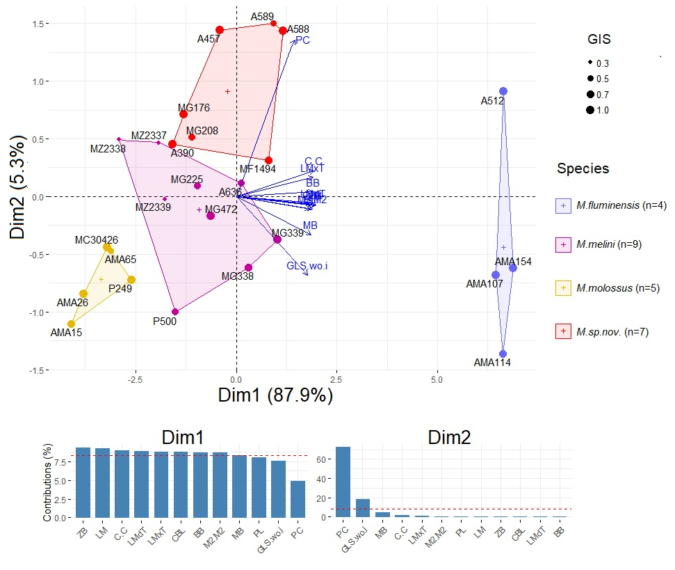
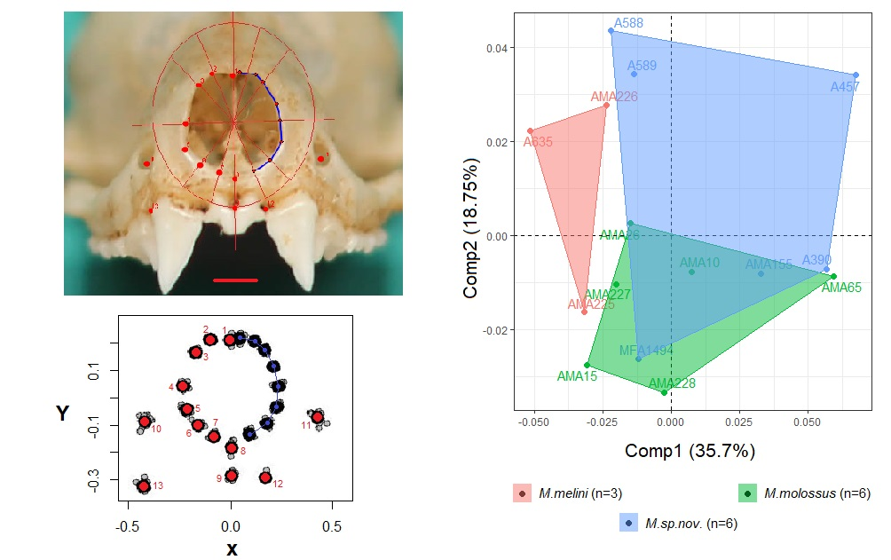
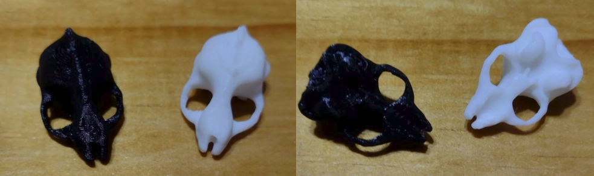
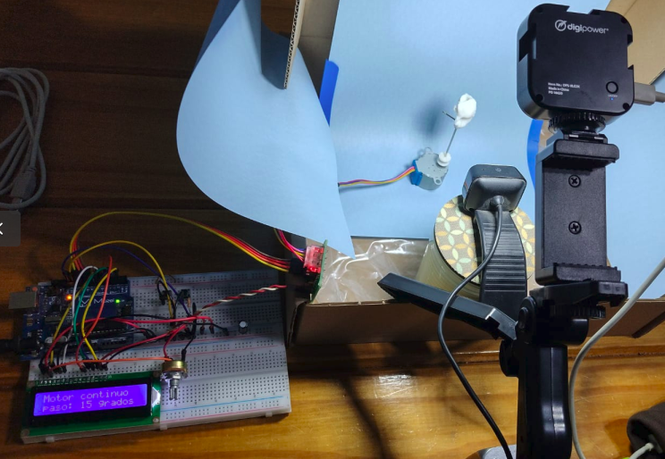
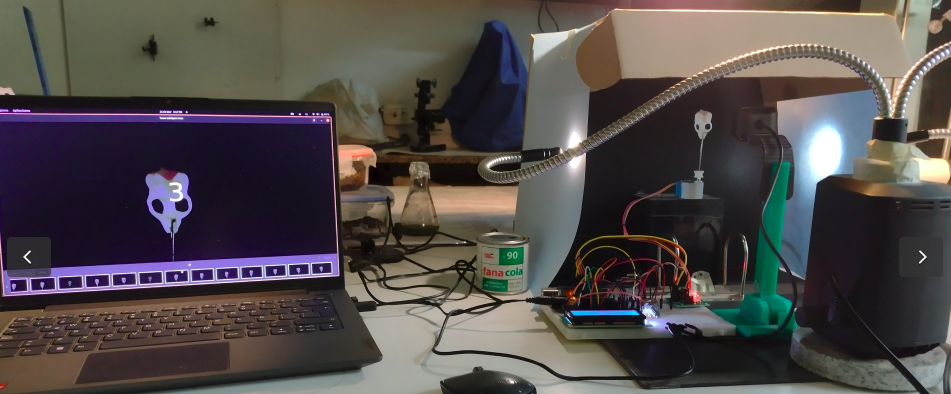
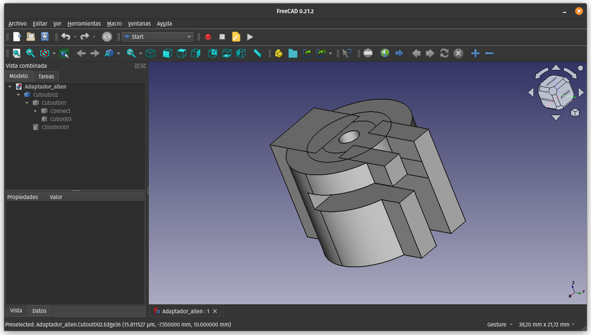
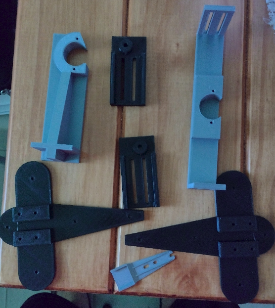
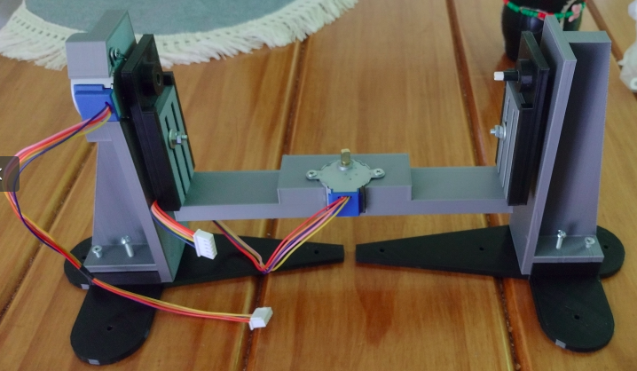
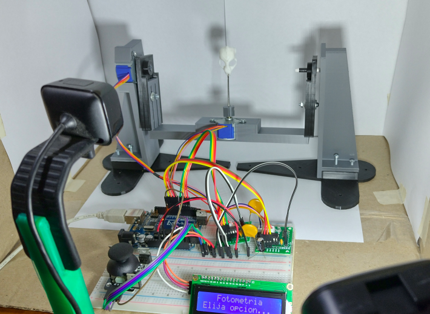
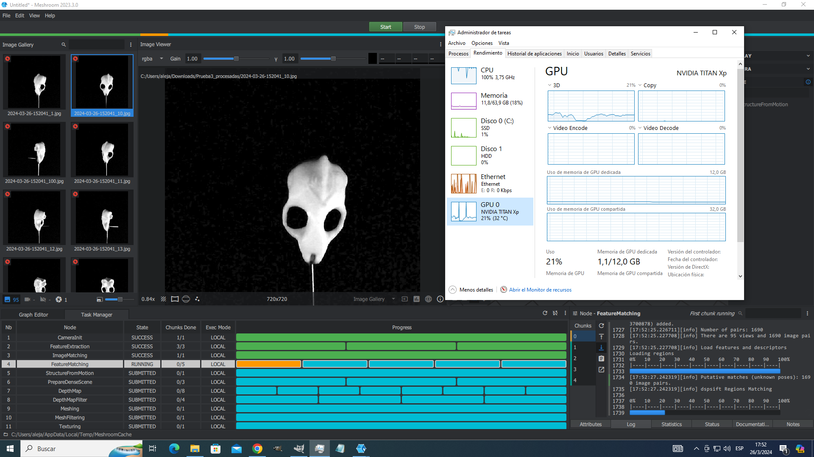

# Inicio

Informe de avances.

## Introducción y Objetivos

### Jornada de Tecnología y Salud

Con el objeto de favorecer las competencias específicas planteadas en el perfil del egresado de la Licenciatura en Bioinformática (FIUNER), el presente trabajo busca abordar un  problema de asignación de especies crípticas de interés epidemiológico en la región del litoral argentino. 

## Desarrollo y Resultados

### Análisis en 2D

En base a caracteres morfológicos discretos o el análisis univariado de variables escalares, una nueva especie de murciélago del género Molossus -definida genéticamente - no podía ser operativamente diferenciada de otros 3 molóssidos que cohabitan en la región central. A partir de este planteo, en base a criterios de factibilidad, los estudiantes lograron identificar, seleccionar críticamente, implementar y testear comparativamente una batería de métodos de adquisición y análisis de datos multidimensionales de morfometría craneal basados en medidas lineales (Fig1) y landmarks en imágenes 2D (Fig2) y objetos 3D obtenidos mediante fotogrametría digital.

{ .image50percent }

{ .image50percent }

### Análisis en 3D

Para llevar a cabo el análisis morfométrico en 3D, se emplearon técnicas de fotogrametría digital con el fin de obtener un modelo tridimensional del cráneo. 

La fotogrametría digital consiste en capturar imágenes del objeto desde múltiples ángulos y utilizar software especializado para combinar estas imágenes y reconstruir una representación tridimensional precisa del objeto en cuestión. Este enfoque permite capturar no solo las dimensiones lineales del objeto, sino también su forma y estructura en tres dimensiones, lo que proporciona una visión más completa de la morfología craneal. 

El modelo tridimensional obtenido se utilizará posteriormente para realizar análisis morfométricos detallados, permitiendo comparaciones precisas entre la nueva especie de murciélago y otras especies del género Molossus presentes en la región central.

#### Fotometría digital

Para ajustar el procedimiento, se utilizó inicialmente un modelo de cráneo de murciélago pálido (Antrozous pallidus) disponible gratuitamente en [thingiverse.com](https://www.thingiverse.com/thing:5380972). El modelo fue escalado para ajustarse al tamaño del cráneo de Molossus. 

Se estableció un setup experimental para capturar fotografías de manera automatizada. En primer lugar, se llevaron a cabo pruebas conceptuales utilizando motores paso a paso y una placa de desarrollo Arduino UNO:

Posteriormente, se exploró la viabilidad de emplear una cámara web USB para el proceso:

Se realizaron pruebas adicionales con una caja de iluminación para mejorar las condiciones de captura:

#### Escaner 3D

Para aumentar la repetibilidad en el escaneo de los cráneos, se decidió adaptar un modelo de escáner 3D utilizando la técnica de fotogrametría de OpenScan en su versión clásica. Este escáner puede ser producido mediante una impresora 3D con tecnología FDM, y los archivos necesarios están disponibles en [thingiverse.com](https://www.thingiverse.com/thing:2755968).

Para el diseño de las piezas personalizadas se utilizó el software de código abierto FreeCAD.

Las piezas fueron impresas en una impresora 3D Hellbot Magna 1v2 usando filamento PLA.

Finalmente, se llevó a cabo el ensamblaje de todas las partes para completar el escáner modificado.

Durante la prueba del escáner, se ejecuta una rutina de escaneo diseñada para capturar imágenes tridimensionales con precisión. Esta rutina comienza con un giro completo de 360° de la pieza en intervalos de 15°, deteniéndose en cada paso para la toma de las fotografías correspondientes. Posteriormente, el brazo lateral del escáner se inclina en un ángulo de 60° en ambas direcciones, con incrementos de 20° en cada movimiento. Cada vez que el brazo lateral se inclina, se realiza un giro completo de la pieza en escaneo, asegurando una cobertura exhaustiva del objeto en estudio.

La rutina se puede apreciar en el siguiente gif:

### Procesado de Imágenes

#### Acondicionamiento

Para optimizar y preparar las imágenes capturadas por el escáner 3D, se utilizó el software de manipulación de imágenes GNU Image Manipulation Program (GIMP). Se empleó la extensión Batch Image Manipulation para aplicar procesamiento a múltiples imágenes de manera eficiente.

El proceso de acondicionamiento consta de las siguientes etapas:

- Recorte:

  - Se ajusta el recorte para alcanzar una relación de aspecto estándar de 1:1.

- Corrección de color:

  - Las imágenes son convertidas a escala de grises.
  - Se aplica una corrección automática de los niveles de color para mejorar la calidad visual.

- Renombrado:

  - Se realiza un renombrado de las imágenes siguiendo un patrón establecido para una mejor organización y referencia.

#### Reconstrucción 3D

La reconstrucción del modelo 3D se llevó a cabo utilizando el software de código abierto Meshroom. Este programa utiliza una técnica conocida como fotogrametría para reconstruir modelos tridimensionales a partir de imágenes 2D.

El proceso comienza cargando las imágenes obtenidas de cada escaneo en el programa Meshroom. A continuación, se ajustan los parámetros del flujo de trabajo, que incluyen configuraciones relacionadas con la detección de características, la correspondencia de puntos entre imágenes y la reconstrucción de la geometría del objeto escaneado.

Meshroom funciona utilizando un enfoque basado en la estructura de grafos para organizar y ejecutar las distintas etapas del proceso de reconstrucción. Cada imagen aporta información sobre la apariencia y la posición relativa del objeto desde diferentes ángulos, lo que permite al programa calcular la estructura tridimensional con precisión.

Es importante destacar que Meshroom es un proyecto de código abierto desarrollado por [AliceVision](https://alicevision.org), una comunidad de desarrollo de software que se enfoca en soluciones de visión por computadora y fotogrametría.

