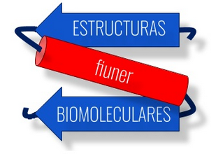
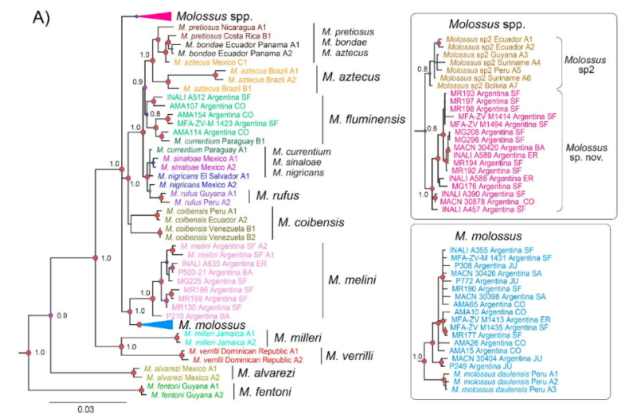
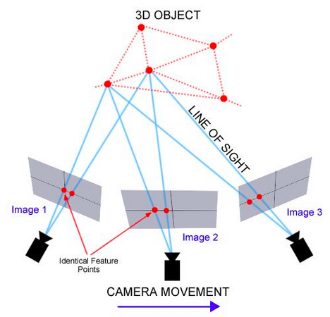
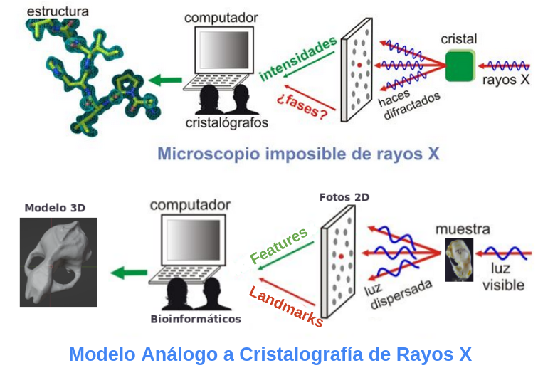

# Inicio

Trabajo Integrador Final de Estructuras Biomoleculares: **Fotogrametría Digital de Cráneo de Murciélago para 3D-GMM**

{ .image30percent }

## Introducción y Objetivos

### Contextualización
Este proyecto se presenta como una extensión del trabajo que se venía realizando en el marco de una Beca Manuel Belgrano (2023-2024) dentro del laboratorio de Salud y Bienestar Integral (LaSBI) de la Facultad de Ingeniería de la UNER.

### Introducción
Con el objeto de favorecer las competencias específicas planteadas en el perfil del egresado de la Licenciatura en Bioinformática (FIUNER), el presente trabajo busca abordar un  problema de asignación de especies crípticas de interés epidemiológico en la región del litoral argentino.

### Objetivo General
  - asdasd
  - asdasd
  - asdasd

## Marco Teórico

### Morfometría Clásica
Uno de los estudios más importantes que se ha llevado a cabo desde los inicios de la biología, es la descripción anatómica y morfológica de los seres vivos con la finalidad de analizar diferencias entre especies y dentro de una misma especie.

En sus orígenes, la morfometría utilizaba variables lineales como medidas, distancias, ángulos o proporciones; a partir de
estas medidas, se obtenía un conjunto de datos que se analizaban por métodos estadísticos multivariados. Los resultados se expresaban como un conjunto de coeficientes y gráficas a través de los cuales las variaciones de tamaño y forma eran difíciles de interpretar, a este enfoque se le llama actualmente morfometría tradicional o clásica.

### Morfometría Geométrica
Debido a las dificultades y limitaciones de la morfometría tradicional, a finales del siglo XX surgió la morfometría geométrica, que ha sido descrita como “una fusión empírica de la geometría con la biología”, ya que analiza la forma de los organismos o de alguna de sus estructuras, considerando el espacio geométrico y empleando métodos estadísticos multivariados.

Los estudios de morfometría geométrica utilizan dos fuentes de información para los análisis, uno es la **homología biológica** y el otro es la **localización geométrica**. La **homología biológica** hace referencia a la correspondencia biológica de determinadas estructuras o partes entre individuos,
mientras que la **localización geométrica** se refiere a la configuración espacial en dos o tres dimensiones de estas estructuras o partes.

Para la localización de estas estructuras homólogas, en morfometría geométrica se utilizan principalmente dos variables: *outlines* (contornos) y los *landmarks*, que son loci anatómicos que no alteran su posición topológica relativamente a otros *landmarks*, proveen una cobertura adecuada de la forma y pueden ser ubicados fácil y repetidamente entre un organismo y otro. Se estableció que existen tres tipos de landmarks:
  - tipo I son yuxtaposiciones discretas de tejido
  - tipo II son zonas de máxima o mínima curvatura
  - tipo III son puntos extremos

### Análisis Generalizado de Procrustes
Al analizar la forma de un organismo o de alguna de sus partes, el primer paso a realizar es que a partir de una imagen en dos o tres dimensiones, se capturen las coordenadas cartesianas expresadas como *landmarks*, *semilandmarks* o contornos.

Los landmarks, contienen información de la forma, tamaño orientación y posición de los objetos, por lo cual no son adecuados para los análisis estadísticos de la forma. Para remover toda la información adicional, se utiliza un Análisis Generalizado de Procrustes (GPA abreviado en inglés).

El método GPA o también conocido como superposición de Procrustes consiste, de manera general, en tres pasos:
  1) Las configuraciones de los *landmarks* son escaladas a un mismo tamaño para remover el efecto de este factor.
  2) Se elimina el efecto de la posición.
  3) Las configuraciones de los *landmarks* se rotan para minimizar las desviaciones entre los *landmarks* correspondientes.

El método de superposición de Procrustes minimiza las diferencias entre las configuraciones de landmarks basado en mínimos cuadrados.

Una vez que se ha realizado la superposición de Procrustes, se obtienen las coordenadas Procrustes de la forma, que son variables que únicamente contienen información de la forma de los organismos y que pueden ser utilizadas en diferentes análisis multivariados; también se obtiene la forma promedio de la estructura u organismo analizado. Dependiendo de los intereses u objetivos de la investigación, estas coordenadas se pueden utilizar en diferentes análisis estadísticos multivariados para comprobar diferentes hipótesis.

### Fotogrametría Digital
La fotogrametría es una técnica cuyo objeto es estudiar y definir con precisión la forma, dimensiones y posición en el espacio de un objeto cualquiera, utilizando esencialmente medidas hechas sobre una o varias fotografías de ese objeto.

Actualmente, esta técnica permite la construcción de un modelo métrico 3D de un objeto, mediante diferentes tipos de softwares informáticos, a partir de una serie de imágenes 2D tomadas desde diferentes perspectivas. Tiene la particularidad de reconstruir la forma, el color y la textura de los objetos utilizando dos algoritmos, SfM (Structure from Motion)​ y MVS (Multi-View Stereo).

### Analogía con Cristalografía de Rayos X 
En base a esto se puede armar una analogía entre el modelo de un microscopio teórico para cristalografía de rayos X.

