# Resultados

## Versión 2.0

### Muestras Procesadas

Se observan a continuación las muestras elegidas:

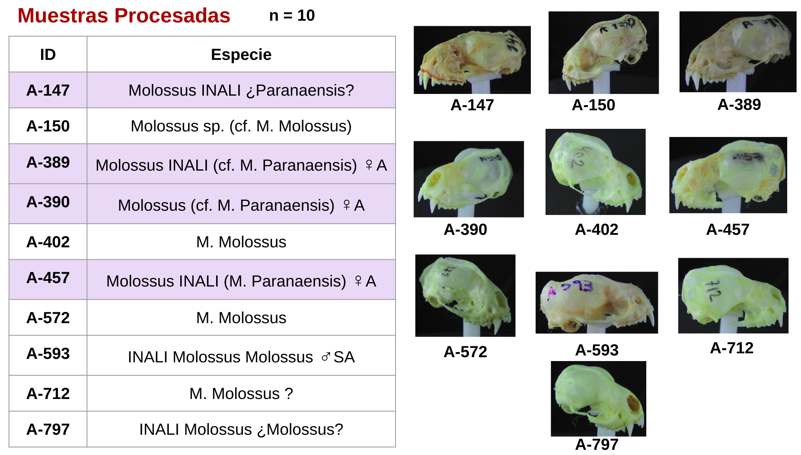

Se muestra a modo de ejemplo una de los modelos correspondiente a la muestra A-150, con y sin textura:

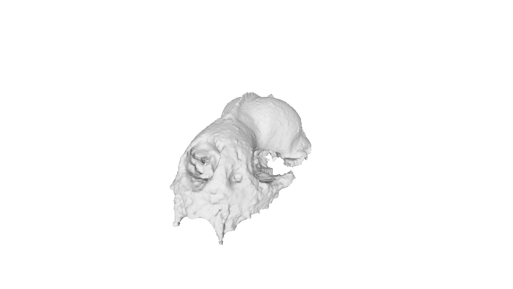

Las demás pueden observarse a continuación:

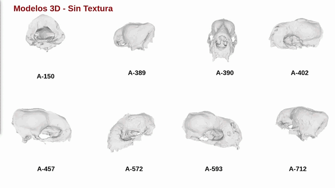

En el apartado de Modelos se pueden encontrar las muestras individuales.

## Análisis Morfométrico 3D

### Colocación de Landmarks 3D

Para la colocación de Landmarks se empleó el software libre 3D Slicer, particularmente la librería SliceMorph.

Se colocaron 24 landmarks craneales, 16 en el hueso nasal y 22 en la nuca.

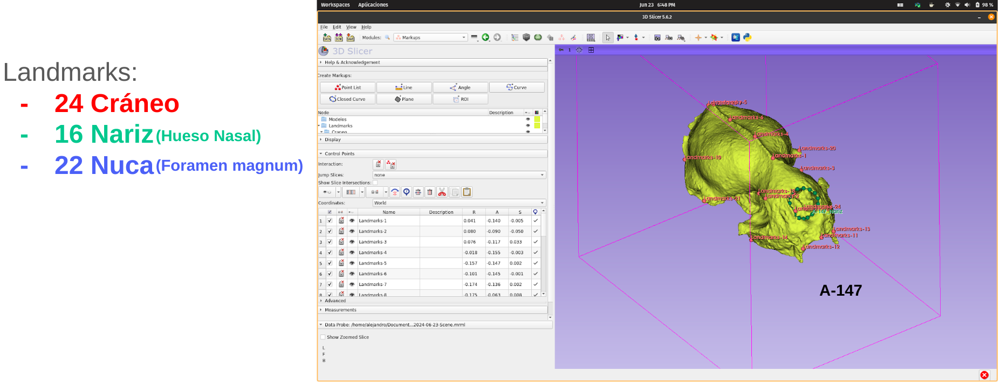

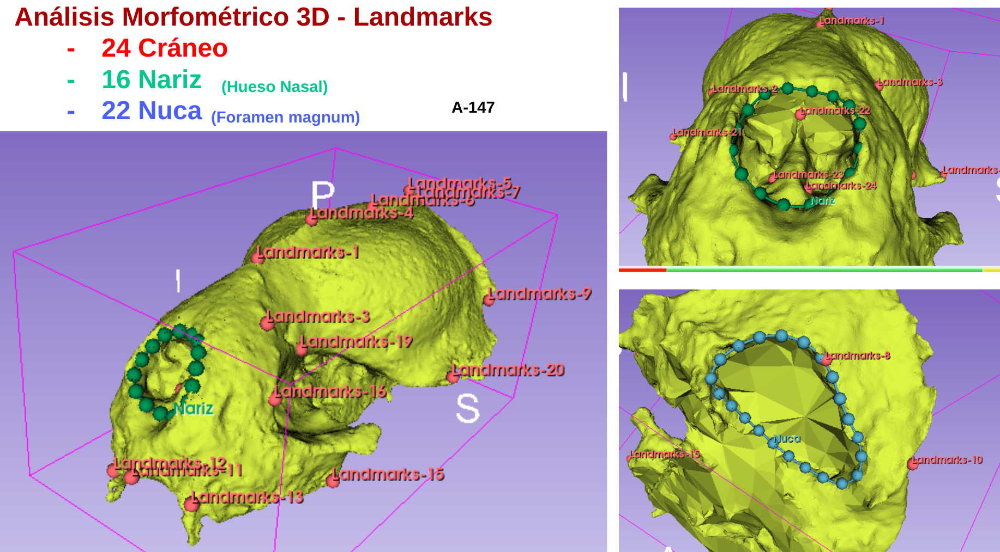

Se empleó el complemento ALPACA para poder transferir los landmarks de una plantilla al resto de los modelos, ahorrando mucho tiempo de marcado manual.

Se muestran todo el conjunto de modelos con los landmarks transferidos.

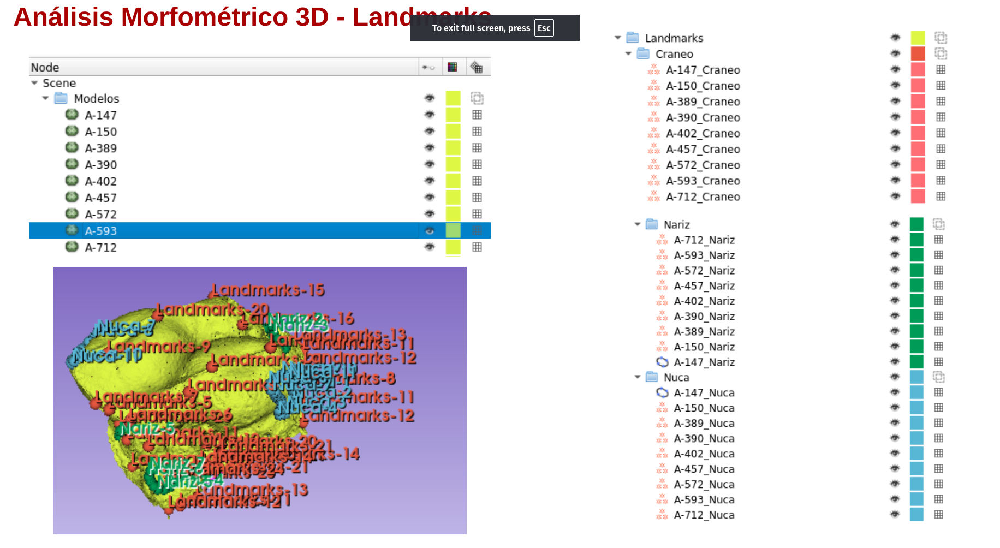

Se observa que los modelos no se encuentran en el mismo sistema de coordenadas, sin embargo, el analisis morfométrico se independiza del tamaño y no es necesario llevarlos todos al mismo sistema coordenado.

### Análisis de Procrustes Generalizado (GPA)

Se realizó el analisis de procrustes, obteniendose los siguientes resultados:

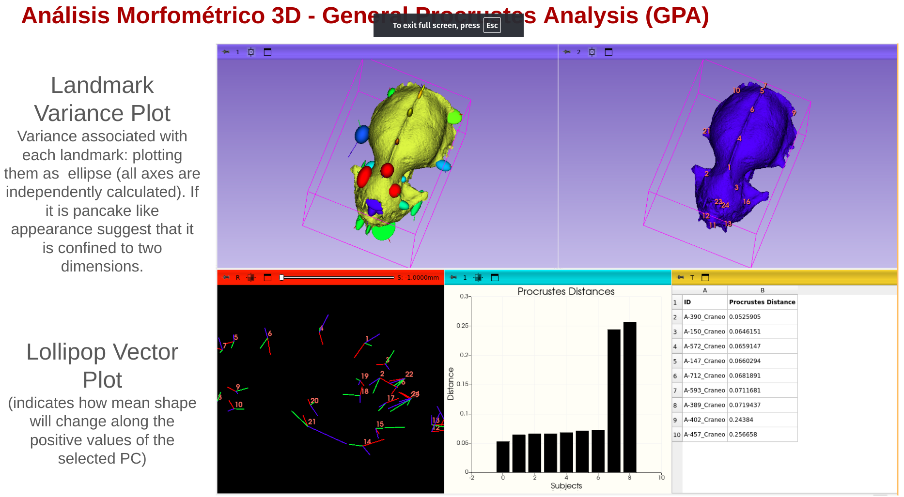

Se muestra el plot de la variación de los landmarks en todos los modelos:

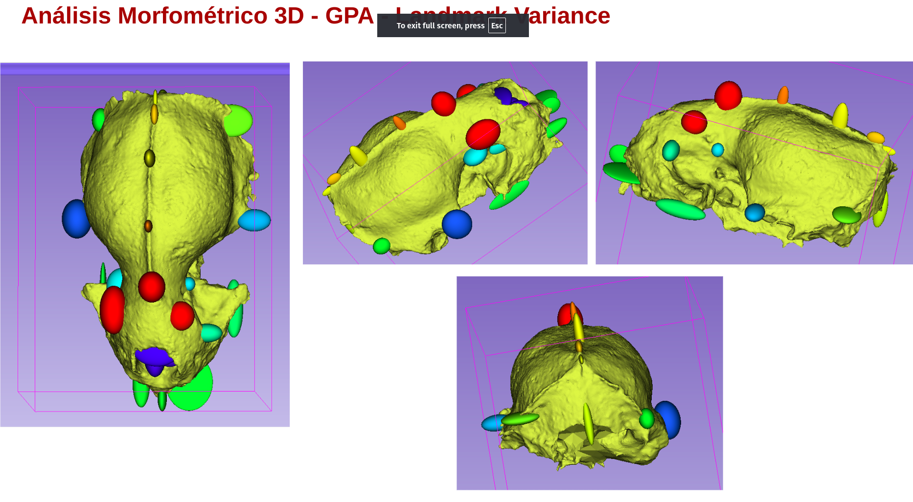

#### Análisis del Cráneo

Se muestran los resultados del análisis de procrustes para los landmarks del cráneo:

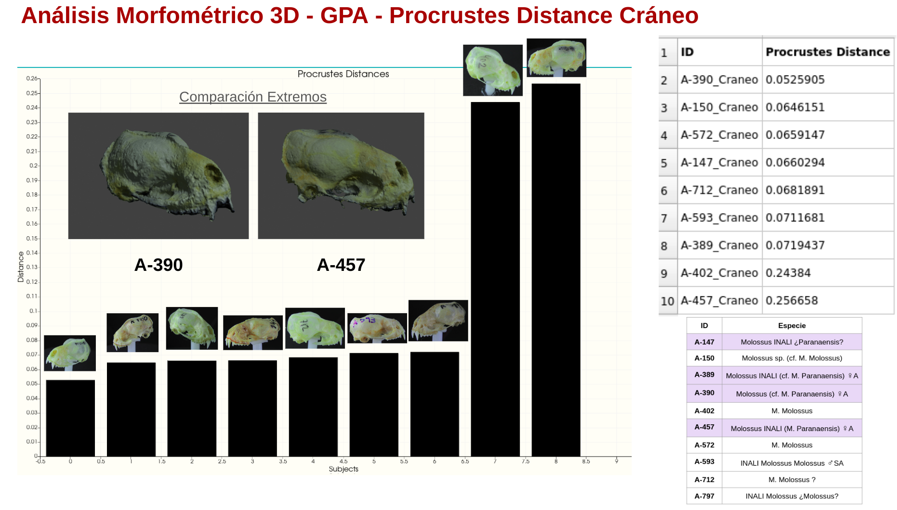

#### Análisis de la Hueso Nasal

Se muestran los resultados del análisis de procrustes para los landmarks del hueso nasal:

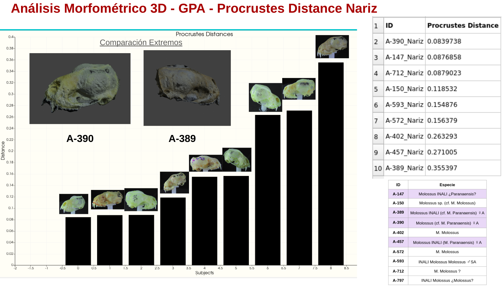

#### Análisis del Foramen Magnum

Se muestran los resultados del análisis de procrustes para los landmarks del foramen magnum:

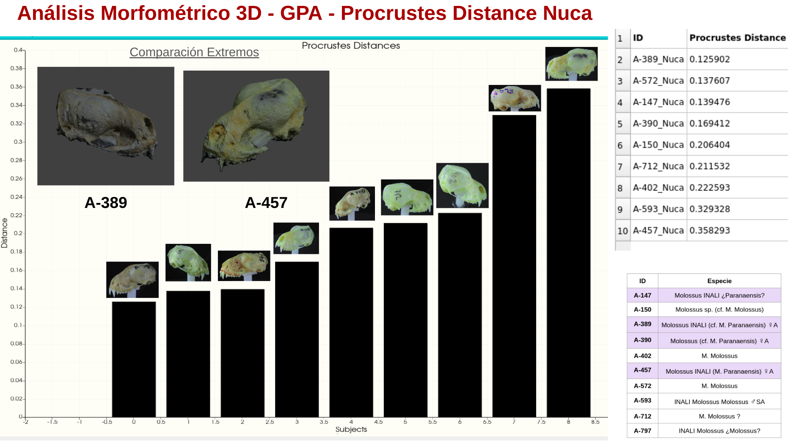

### Alineamiento Simple

Se realizó un alineamiento simple entra las muestras A-147 y A-150 para observar las diferencias en las estructuras:

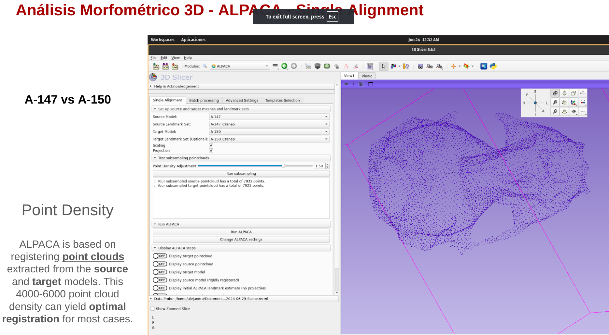

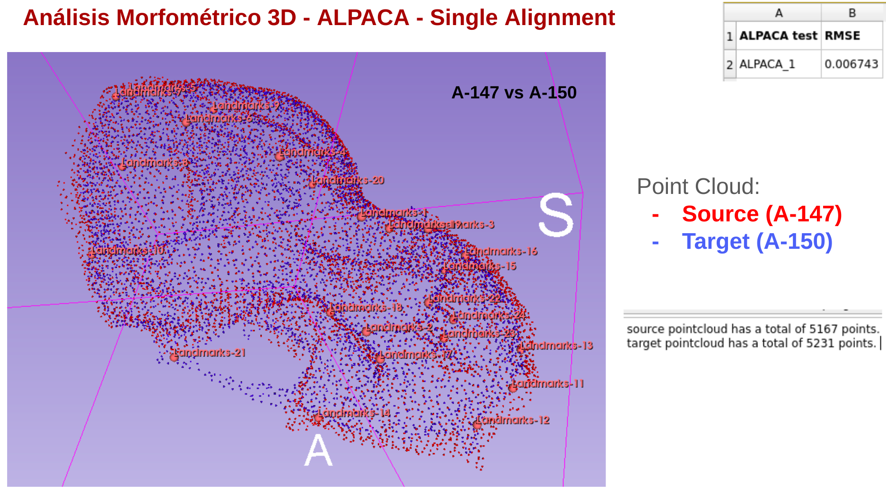

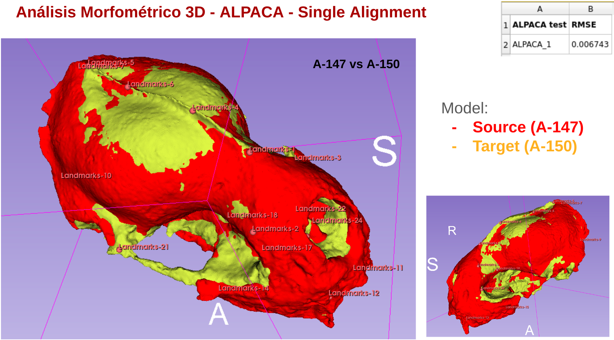

